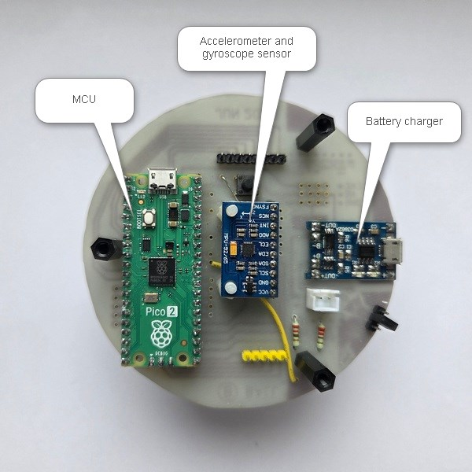
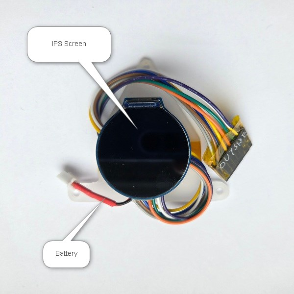
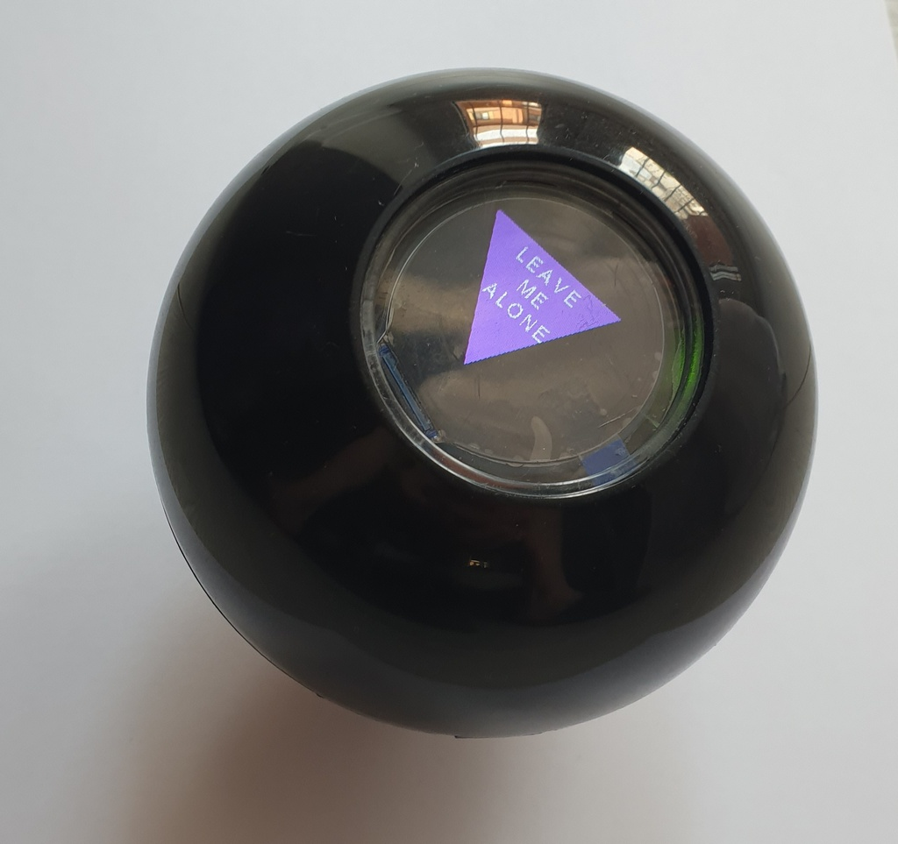
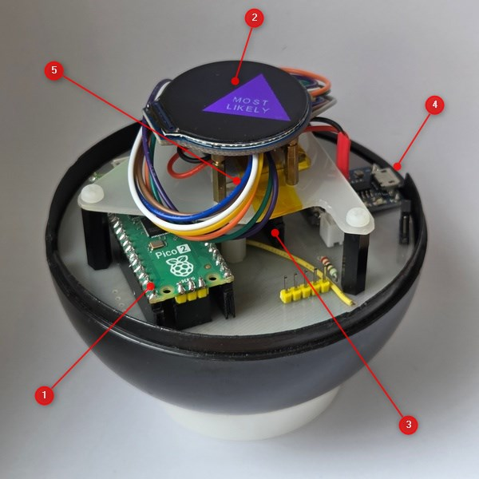
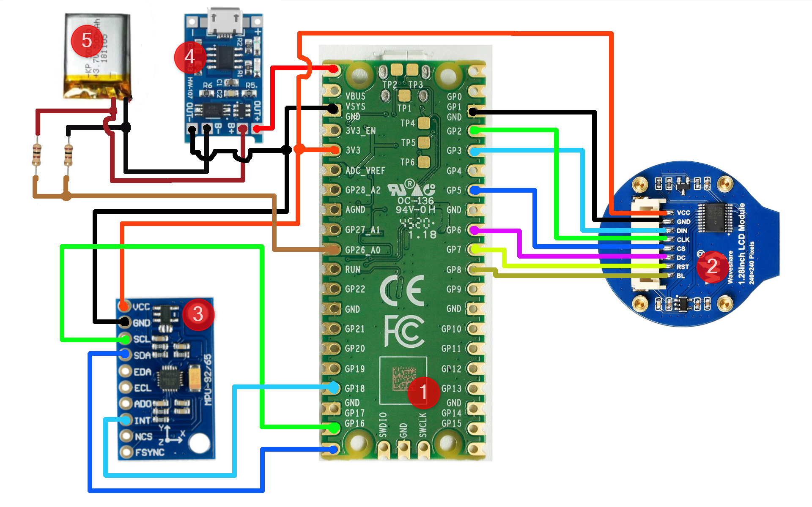
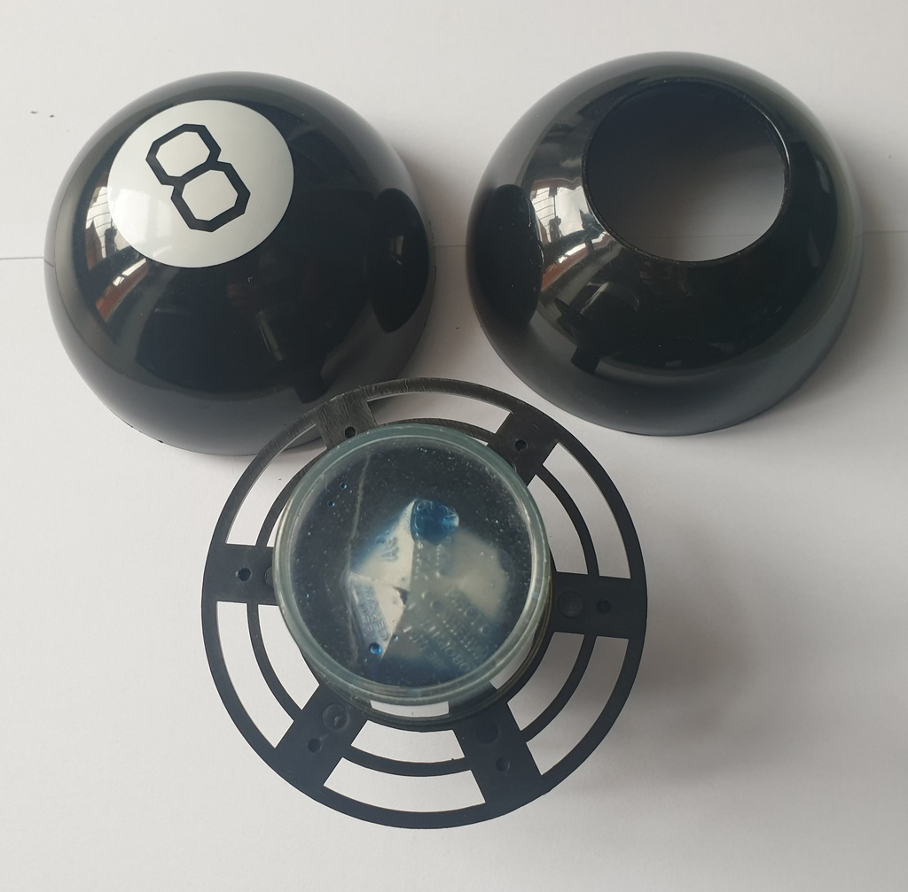
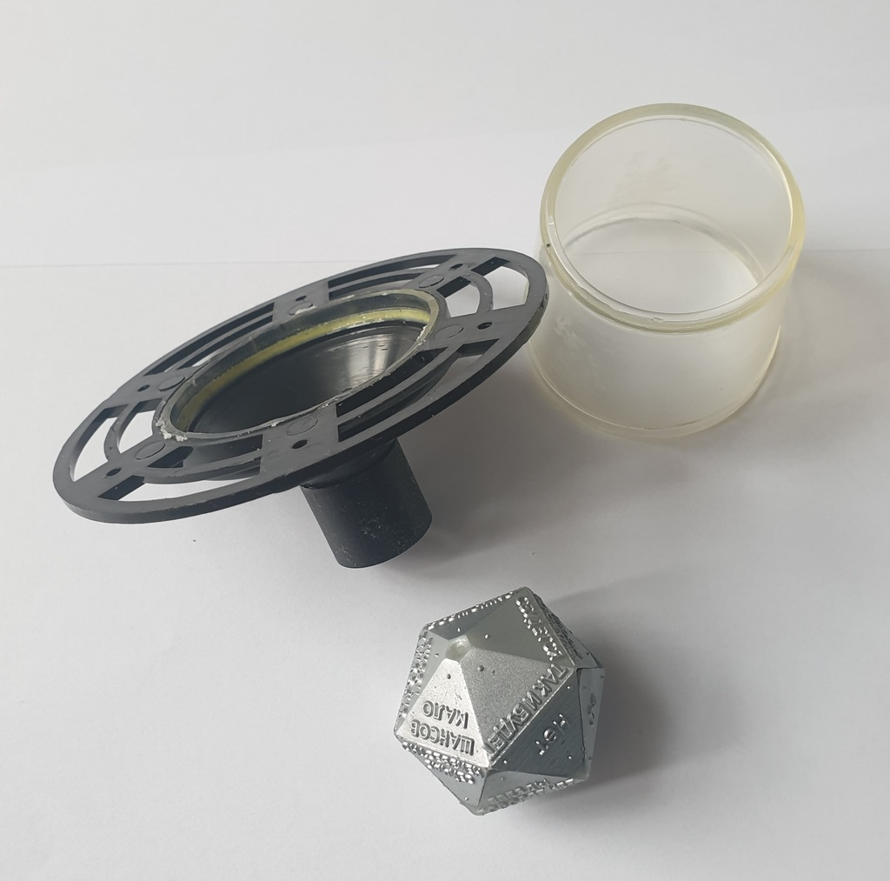

# Magic 8 Ball toy

I would like to share a small DIY project that resulted from my desire to utilize a 1.25" round display and play around with Raspberry Pi Pico boards. Using the accelerometer allows the device to detect its orientation, recognize gestures such as shaking and rotating, and detect when it is idle. This makes it possible to emulate the floating behavior of the 20x dice. The dice image is visualized on the round screen, which surprisingly fits the window of the 8-ball toy perfectly. The device controls the battery voltage and changes the triangle color from blue to red as the battery drains.

The device waits to be rotated face down and shaken. Then, when faced up, it randomly generates the prophecy on the dice side from a hardcoded list. When not in use, the device goes to sleep to save battery.

## Hardware 

1. [RP2350 board](https://www.raspberrypi.com/products/raspberry-pi-pico-2/)
2. [1.28 inch LCD module](https://www.waveshare.com/wiki/1.28inch_LCD_Module)
3. [MPU-9250 accel and gyro module](https://cdn.sparkfun.com/assets/learn_tutorials/5/5/0/MPU-9250-Register-Map.pdf) 
4. Li-ion battery charger board TP4056
5. Li-ion battery

### Wiring

Here is a diagram of how to wire the components.

### Case

The liquid in the 8-Ball toy was drained long ago, so it was disassembled and all of its components were removed, except for the shell.

## Firmware

The firmware utilizes both Pico cores: one processes the accelerometer data, and the other visualizes the floating dice. It was initially developed for the RP2040 platform, so adjustments may be necessary for optimal performance on the RP2350.

### Development

Visual Studio Code with the Pico extension was used for development, and the [Raspberry Pi Debug Probe](https://www.raspberrypi.com/documentation/microcontrollers/debug-probe.html) served as the debugger. A [UF2 file](https://github.com/lds133/pico_8ball/raw/refs/heads/main/bin/pico2_8ball_ver01.uf2) is provided for quick testing.

