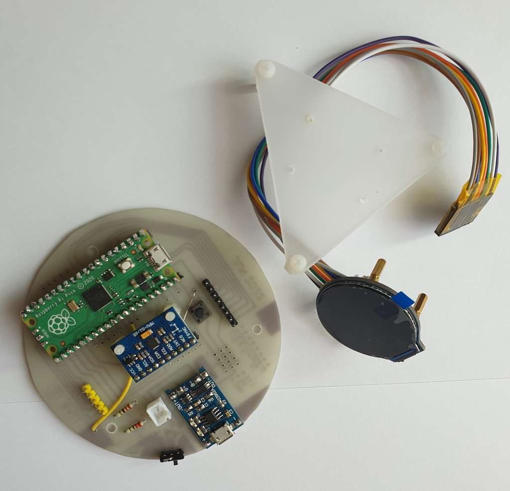
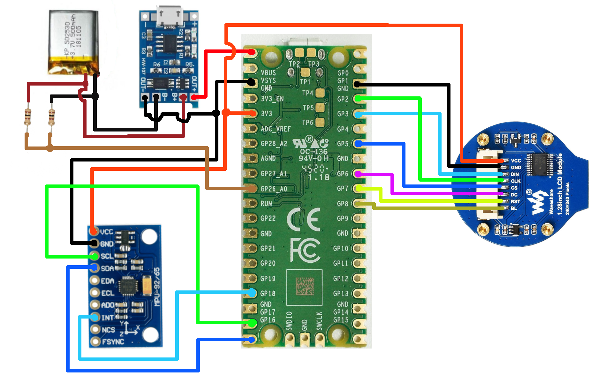
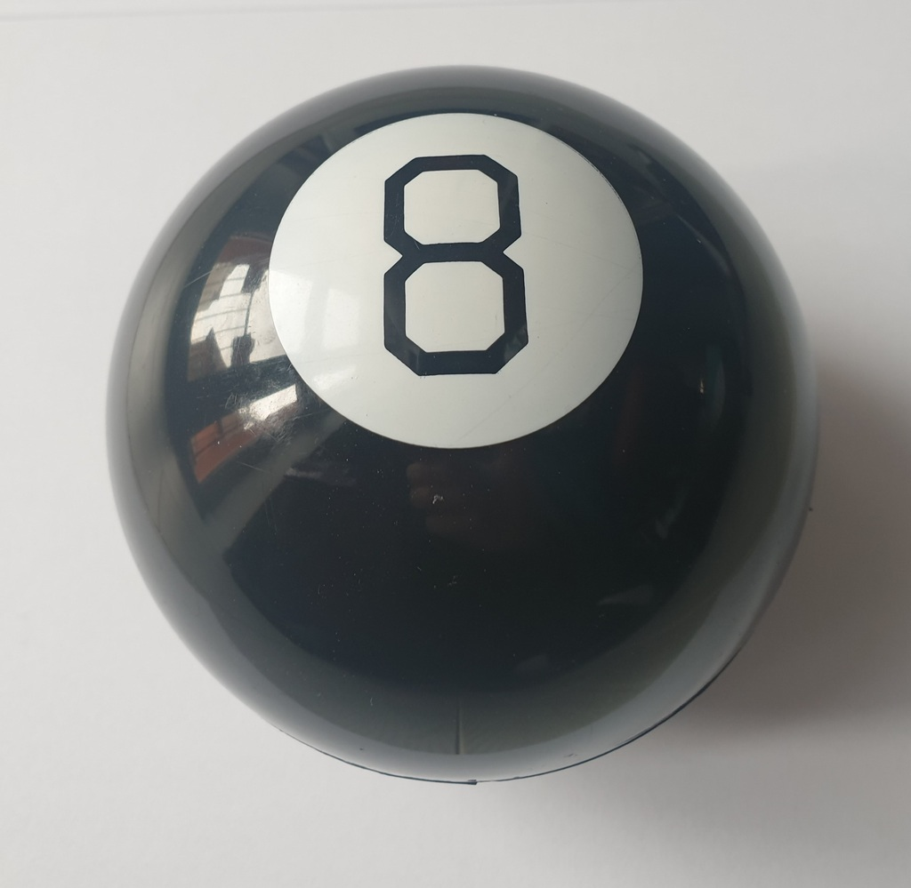

# Magic 8 Ball toy

Customizable prophecy hardware platform based on the Magic 8 Ball toy with shake detection, screen animation, and prophecy rendering, is recommended here. 

## Hardware 

1. [RP2350 board](https://www.raspberrypi.com/products/raspberry-pi-pico-2/)
1. [1.28 inch LCD module](https://www.waveshare.com/wiki/1.28inch_LCD_Module)
1. [MPU-9250 accel and gyro module](https://cdn.sparkfun.com/assets/learn_tutorials/5/5/0/MPU-9250-Register-Map.pdf) 
1. Li-ion battery charger board TP4056
1. Li-ion battery

### Wiring

Follow the diagram below to correctly connect all hardware components.

### Case

Repurposed shell from a broken Magic 8 Ball toy, used as the enclosure for the device.

## Firmware

The firmware handles all core device functionality, including:

1. Reading motion data from the MPU-9250 sensor
1. Detecting shake gestures using configurable acceleration thresholds
1. Generating pseudo-random prophecies
1. Rendering text and basic graphics on the LCD display
1. Monitoring battery voltage levels and status indicators

### Development

Build and flash the firmware using Visual Studio Code with the Pico extension installed.

### Flashing

The firmware was flashed using a [Raspberry Pi Debug Probe](https://www.raspberrypi.com/documentation/microcontrollers/debug-probe.html). 

## Using instructions

1. **Invert and activate** Hold the device with the viewing window facing downward. Gently shake to initialize the response mechanism.
2. **Submit your query**  Clearly speak your question aloud while holding the device steady.
3. **Reveal the outcome** Rotate the device so the viewing window faces upward. Observe the displayed prophecy.

## Notes

- **Shake thoroughly for accurate results** The prophecy is generated using accelerometer input-insufficient movement may affect outcome quality.
- **Hardware compatibility** The codebase was originally developed for the RP2040 platform and may require adjustments for optimal performance on RP2350.
- **Optional guidance** Prophecies are provided for entertainment purposes only; adherence is not required.
- **Low battery indicator** A red triangle signifies that the battery level is low.